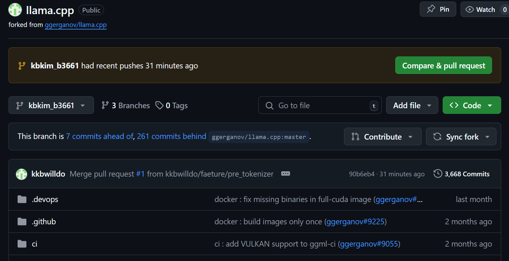
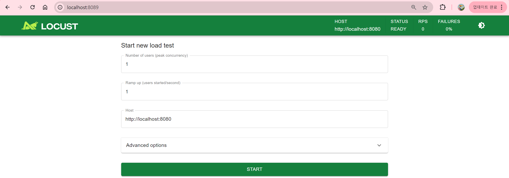
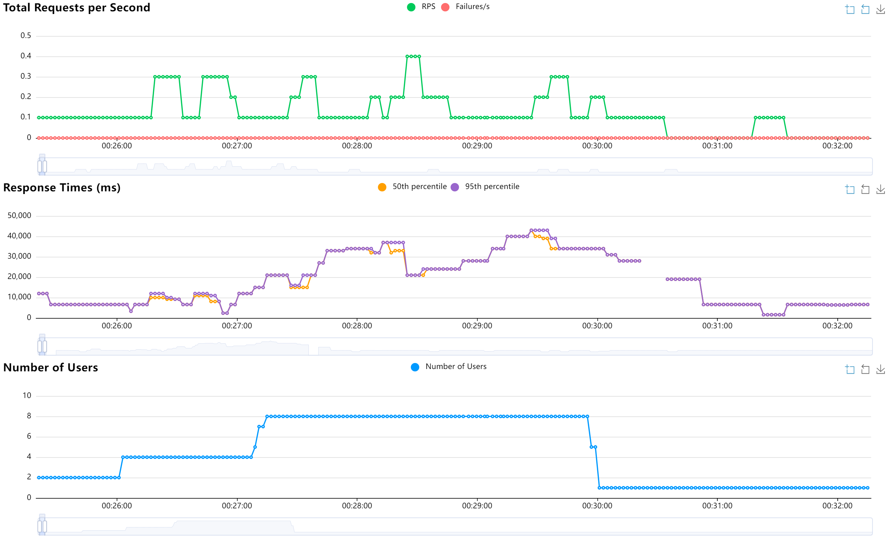

# Llama CPP Sys

## 프로젝트

- [42dot_LLM-PLM-1.3B](https://huggingface.co/42dot/42dot_LLM-PLM-1.3B) 모델을 llama.cpp의 [b3661 Release](https://github.com/ggerganov/llama.cpp/tree/b3661)를 이용하여 inference를 수행합니다.
- 기본 FP16 모델과 INT4 quantized 모델 간의 [MMLU benchmark](https://huggingface.co/datasets/cais/mmlu)를 수행하며, 이 때 INT4 Quantized 모델의 품질 하락을 최소화 하도록 합니다.
- Input sequence는 2560, output sequence는 768로 설정한 request를 처리하는 데 FP16 모델과 quantized된 모델 간의 처리 속도를 측정합니다. 이 때 1개, 2개, 4개, 8개의 동시 requests가 발생할 때의 처리 속도를 측정합니다.

## 프로젝트 구성

- 프로젝트는 도커 이미지를 위한 `Dockerfile`과 컨테이너에서 실행할 스크립트들로 구성됩니다.
- 해당 도커 이미지는 `NGC`를 기반으로하며 llama.cpp를 [`fork`한 레포지토리](https://github.com/kkbwilldo/llama.cpp/tree/kbkim_b3661)를 클론한 후 `GGML_CUDA=1` 플래그와 함께 빌드를 수행합니다.
        

- fork한 llama.cpp는 b3661 Release를 기반으로 하며 42dot_LLM-PLM-1.3B를 gguf로 변환할 수 있도록 일부 코드를 수정하였습니다.

```shell
.
├── checkpoints_42dot_LLM-PLM-1.3B <---- 스크립트 실행으로 생성될 내용
│   ├── added_tokens.json
│   ├── asset
│   ├── config.json
│   ├── generation_config.json
│   ├── merges.txt
│   ├── model.safetensors
│   ├── pytorch_model.bin
│   ├── README.md
│   ├── special_tokens_map.json
│   ├── tokenizer_config.json
│   ├── tokenizer.json
│   └── vocab.json
├── Dockerfile
├── locustfile.py
├── outputs                        <---- 스크립트 실행으로 생성될 내용
│   └── checkpoints_42dot_LLM-PLM-1.3B-42dot-PLM-F16.gguf
├── scripts_download
│   └── download_model.py
├── scripts_run
│   ├── build_docker.sh
│   ├── run_checkpoint_to_gguf_conversion.sh
│   ├── run_container.sh
│   ├── run_download_mmlu_dataset.sh
│   ├── run_inference.sh
│   ├── run_llama_cpp_server.sh
│   ├── run_locust.sh
│   └── run_mmlu_bench.sh
└── vimrc
```


## 프로젝트 실행

### 1. 모델 다운로드

- 프로젝트의 기초가 되는 [42dot_LLM-PLM-1.3B](https://huggingface.co/42dot/42dot_LLM-PLM-1.3B) 모델을 다운로드합니다.
- `scripts_download` 디렉토리에서 다음 스크립트를 실행하여 모델을 다운로드합니다.

```bash
scripts_download $ python download_model.py
```

- 이 스크립트를 실행하면 root 디렉토리에 `checkpoints_42dot_LLM-PLM-1.3B`라는 디렉토리가 생성되며 여기에 모델 관련 파일들이 다운로드됩니다.

### 2. 도커 이미지 빌드

- llama.cpp가 설치된 이미지를 빌드합니다.

```Dockerfile
# Dockerfile

# NVIDIA PyTorch container를 베이스 이미지로 사용합니다.
FROM nvcr.io/nvidia/pytorch:24.02-py3

# root 및 kbkim 패스워드 설정                                                                                 
RUN useradd -m kbkim && echo 'kbkim:kbkim' | chpasswd && adduser kbkim sudo
RUN echo 'root:kbkim' | chpasswd

# 워킹 디렉토리를 설정합니다.
WORKDIR /home/kbkim

# vimrc를 복사하여 세팅합니다.
COPY vimrc ./.vimrc
COPY vimrc /root/.vimrc

# 패키지 목록을 업데이트하고 업그레이드합니다.
RUN apt update && apt upgrade -y

# sudo, git, tmux를 설치합니다.
RUN apt-get update && apt-get install -y sudo git tmux

# llama.cpp를 클론합니다. 빌드 이슈로 인해 빌드는 컨테이너에서 진행합니다.
RUN git clone https://github.com/kkbwilldo/llama.cpp.git
WORKDIR /home/kbkim/llama.cpp
RUN git checkout kbkim_b3661
WORKDIR /home/kbkim/

# 필요한 라이브러리를 설치합니다.
RUN pip install sentencepiece transformers safetensors locust datasets
```

- 이 이미지는 NGC를 기반으로 레이어가 구성됩니다.
- user와 root 설정 및 vim 그리고 기타 개발에 필요한 패키지를 추가합니다.
- `scripts_run 디렉토리`에 존재하는 `build_docker.sh` 스크립트를 실행하여 도커 이미지를 빌드합니다.
- 이 빌드는 `--no-cache` 플래그를 사용하여 캐시된 레이어를 사용하지 않도록 합니다. 이는 fork된 레포지토리의 업데이트를 매번 반영할 수 있도록 조치한 것입니다.
- llama.cpp 빌드 이슈로 인해 llama.cpp의 빌드는 컨테이너 안에서 수행합니다.

```bash
scripts_run $ ./build_docker.sh
```
- 이미지가 빌드되면 `llama_cpp`라는 이름으로 다음과 같이 확인할 수 있습니다.

**예상 출력**
```bash
$ docker images
REPOSITORY           TAG             IMAGE ID       CREATED        SIZE
llama_cpp            pytorch-24.02   5ae5170b2eaa   2 hours ago    27.2GB
```


### 3. 도커 컨테이너 실행

- 빌드된 도커 이미지를 실행하여 컨테이너를 띄웁니다.
- `scripts_run 디렉토리`에서 다음의 스크립트를 실행하여 `llama_cpp`라는 이름의 도커 컨테이너를 띄웁니다.

```bash
scripts_run $ ./run_container.sh
```

**예상 출력**

```bash
=============
== PyTorch ==
=============

NVIDIA Release 24.02 (build 82611821)
PyTorch Version 2.3.0a0+ebedce2
Container image Copyright (c) 2024, NVIDIA CORPORATION & AFFILIATES. All rights reserved.
Copyright (c) 2014-2024 Facebook Inc.
Copyright (c) 2011-2014 Idiap Research Institute (Ronan Collobert)
Copyright (c) 2012-2014 Deepmind Technologies    (Koray Kavukcuoglu)
Copyright (c) 2011-2012 NEC Laboratories America (Koray Kavukcuoglu)
Copyright (c) 2011-2013 NYU                      (Clement Farabet)
Copyright (c) 2006-2010 NEC Laboratories America (Ronan Collobert, Leon Bottou, Iain Melvin, Jason Weston)
Copyright (c) 2006      Idiap Research Institute (Samy Bengio)
Copyright (c) 2001-2004 Idiap Research Institute (Ronan Collobert, Samy Bengio, Johnny Mariethoz)
Copyright (c) 2015      Google Inc.
Copyright (c) 2015      Yangqing Jia
Copyright (c) 2013-2016 The Caffe contributors
All rights reserved.

Various files include modifications (c) NVIDIA CORPORATION & AFFILIATES.  All rights reserved.

This container image and its contents are governed by the NVIDIA Deep Learning Container License.
By pulling and using the container, you accept the terms and conditions of this license:
https://developer.nvidia.com/ngc/nvidia-deep-learning-container-license

NOTE: The SHMEM allocation limit is set to the default of 64MB.  This may be
   insufficient for PyTorch.  NVIDIA recommends the use of the following flags:
   docker run --gpus all --ipc=host --ulimit memlock=-1 --ulimit stack=67108864 ...

root@desktop:/home/kbkim#
```

- 이 컨테이너는 host의 네트워크를 사용하여 컨테이너 내부의 애플리케이션이 host의 IP와 port를 그대로 사용합니다. 따라서 local host에서 remote container의 locust web UI에 접근할 수 있습니다.
- 또한 필요한 파일과 디렉토리를 마운트하며, `-i(interactive)`와 `-t(pseudo-TTY)` 옵션을 사용합니다.
- 이 컨테이너 상에서 gguf 변환 및 llama-cli, llama-server 등을 테스트합니다.
- 컨테이너 안에 `llama.cpp` 디렉토리가 존재하며 이 디렉토리는 llama.cpp의 `b3661 태그`를 기반으로 하는 fork된 레포지토리입니다. 해당 디렉토리로 접속한 후, `kbkim_build_script.sh`를 실행하여 llama.cpp를 빌드합니다.

```bash
root@desktop:/home/kbkim/llama.cpp# ./kbkim_build_script.sh
```

**예상 출력**

```bash
root@desktop:/home/kbkim/llama.cpp# ./kbkim_build_script.sh
I ccache not found. Consider installing it for faster compilation.
I llama.cpp build info:
I UNAME_S:   Linux
I UNAME_P:   x86_64  
I UNAME_M:   x86_64 
I CFLAGS:    -Iggml/include -Iggml/src -Iinclude -Isrc -Icommon -D_XOPEN_SOURCE=600 -D_GNU_SOURCE -DNDEBUG -DGGML_USE_OPENMP -DGGML_USE_LLAMAFILE -DGGML_USE_CUDA -I/usr/local/cuda/include -I/usr/local/cuda/targets/x86_64-linux/include -DGGML_CUDA_USE_GRAPHS  -std=c11   -fPIC -O3 -g -Wall -Wextra -Wpedantic -Wcast-qual -Wno-unused-function -Wshadow -Wstrict-prototypes -Wpointer-arith -Wmissing-prototypes -Werror=implicit-int -Werror=implicit-function-declaration -pthread -march=native -mtune=native -fopenmp -Wdouble-promotion

...

```

- (Optional) 빌드 삭제
    - 빌드 과정에서 생성된 임시 파일이나 컴파일된 파일은 `make clean` 명령어로 삭제할 수 있습니다. 이 명령어로 빌드 생성물들을 삭제한 후 다시 깨끗한 상태에서 빌드할 수 있습니다.

    ```bash
    root@desktop:/home/kbkim/llama.cpp# make clean
    ```
- 빌드 후 부모 디렉토리인 `/home/kbkim`에 있는 스크립트들을 활용하여 llama.cpp 시스템을 사용합니다.


### 4. 모델 체크포인트를 gguf 형으로 변환

- llama.cpp에서 모델을 추론하기 위해 체크포인트 형을 gguf 형으로 변환해야합니다.
- 컨테이너에서 `run_checkpoint_to_gguf_conversion.sh` 스크립트를 실행하여 `outputs` 디렉토리에 모델 체크포인트를 gguf로 변환한 내용을 저장합니다.

```bash
root@desktop:/home/kbkim# ./run_checkpoint_to_gguf_conversion.sh
```

**예상 출력**

```bash
DEBUG:urllib3.connectionpool:Starting new HTTPS connection (1): huggingface.co:443
DEBUG:urllib3.connectionpool:https://huggingface.co:443 "GET /meta-llama/Llama-2-7b-hf/resolve/main/config.json HTTP/1.1" 403 167

...

INFO:hf-to-gguf:Set model quantization version
INFO:gguf.gguf_writer:Writing the following files:
INFO:gguf.gguf_writer:../outputs/checkpoints_42dot_LLM-PLM-1.3B-42dot-PLM-F16.gguf: n_tensors = 219, total_size = 2.9G
Writing: 100%|███████████████████████████████████████████████████████████████████████████████████████████| 2.88G/2.88G [00:03<00:00, 959Mbyte/s]
INFO:hf-to-gguf:Model successfully exported to ../outputs/checkpoints_42dot_LLM-PLM-1.3B-42dot-PLM-F16.gguf
```


### 5. llama-cli 실행

- llama.cpp의 llama-cli를 테스트 해봅니다.
- 컨테이너에서 `run_llama_cli.sh`를 실행하여 text completion을 테스트합니다.

```bash
root@desktop:/home/kbkim# ./run_llama_cli.sh
```

**예상 출력**

```bash
Log start
main: build = 3664 (8832147c)
main: built with cc (Ubuntu 11.4.0-1ubuntu1~22.04) 11.4.0 for x86_64-linux-gnu
main: seed  = 1728475922
llama_model_loader: loaded meta data with 30 key-value pairs and 219 tensors from ./outputs/checkpoints_42dot_LLM-PLM-1.3B-42dot-PLM-F16.gguf (version GGUF V3 (latest))
llama_model_loader: Dumping metadata keys/values. Note: KV overrides do not apply in this output.
llama_model_loader: - kv   0:                       general.architecture str              = llama
llama_model_loader: - kv   1:                               general.type str              = model
llama_model_loader: - kv   2:                               general.name str              = 42dot PLM 1.3B

...

system_info: n_threads = 8 (n_threads_batch = 8) / 24 | AVX = 1 | AVX_VNNI = 1 | AVX2 = 1 | AVX512 = 0 | AVX512_VBMI = 0 | AVX512_VNNI = 0 | AVX512_BF16 = 0 | FMA = 1 | NEON = 0 | SVE = 0 | ARM_FMA = 0 | F16C = 1 | FP16_VA = 0 | WASM_SIMD = 0 | BLAS = 1 | SSE3 = 1 | SSSE3 = 1 | VSX = 0 | MATMUL_INT8 = 0 | LLAMAFILE = 1 |
sampling:
        repeat_last_n = 64, repeat_penalty = 1.000, frequency_penalty = 0.000, presence_penalty = 0.000
        top_k = 40, tfs_z = 1.000, top_p = 0.950, min_p = 0.050, typical_p = 1.000, temp = 0.800
        mirostat = 0, mirostat_lr = 0.100, mirostat_ent = 5.000
sampling order:
CFG -> Penalties -> top_k -> tfs_z -> typical_p -> top_p -> min_p -> temperature
generate: n_ctx = 4096, n_batch = 2048, n_predict = 128, n_keep = 0


I believe the meaning of life is to be a good person,” he said. “There are many good people out there, and it’s our responsibility to help them be great ones.”
For more information about the program, visit the University of Chicago’s Department of Psychology’s website at https://psychology.uchicago.edu/people/faculty/huntington-john-w-a/
More news from the University of Chicago
New research reveals the critical role of a protein in the development of the immune system
New research reveals the critical role of a protein in the development of the immune system The research, which was conducted
llama_print_timings:        load time =     485.29 ms
llama_print_timings:      sample time =       3.38 ms /   128 runs   (    0.03 ms per token, 37881.03 tokens per second)
llama_print_timings: prompt eval time =      98.44 ms /     7 tokens (   14.06 ms per token,    71.11 tokens per second)
llama_print_timings:        eval time =    6114.28 ms /   127 runs   (   48.14 ms per token,    20.77 tokens per second)
llama_print_timings:       total time =    6223.38 ms /   134 tokens
Log end
```

### 6. MMLU 벤치마크

- MMLU 벤치마크를 수행하기 위해 데이터셋을 다운로드합니다.
- 컨테이너에서 `download_mmlu_dataset_and_convert_to_bin.sh` 스크립트를 실행하여 Huggingface의 ["cais/mmlu"](https://huggingface.co/datasets/cais/mmlu)에서 MMLU 데이터셋을 다운로드 받은 후 이를 bin 파일로 변환합니다.

```bash
root@desktop:/home/kbkim# ./download_mmlu_dataset_and_convert_to_bin.sh
```

**예상 출력**

```bash
root@desktop:/home/kbkim# ./download_mmlu_dataset_and_convert_to_bin.sh
README.md: 100%|█████████████████████████████████████████████████████████████████████████████████████████| 53.2k/53.2k [00:00<00:00, 29.5MB/s]
dataset_infos.json: 100%|███████████████████████████████████████████████████████████████████████████████████| 138k/138k [00:00<00:00, 531kB/s]
test-00000-of-00001.parquet: 100%|███████████████████████████████████████████████████████████████████████| 3.50M/3.50M [00:00<00:00, 11.7MB/s]
validation-00000-of-00001.parquet: 100%|███████████████████████████████████████████████████████████████████| 408k/408k [00:00<00:00, 6.03MB/s]
dev-00000-of-00001.parquet: 100%|████████████████████████████████████████████████████████████████████████| 76.5k/76.5k [00:00<00:00, 10.9MB/s]
auxiliary_train-00000-of-00001.parquet: 100%|████████████████████████████████████████████████████████████| 47.5M/47.5M [00:04<00:00, 11.7MB/s]
Generating test split: 100%|█████████████████████████████████████████████████████████████████| 14042/14042 [00:00<00:00, 931728.42 examples/s]
Generating validation split: 100%|█████████████████████████████████████████████████████████████| 1531/1531 [00:00<00:00, 715325.77 examples/s]
Generating dev split: 100%|██████████████████████████████████████████████████████████████████████| 285/285 [00:00<00:00, 329759.07 examples/s]
Generating auxiliary_train split: 100%|██████████████████████████████████████████████████████| 99842/99842 [00:00<00:00, 481079.53 examples/s]
Transformation complete. Data saved to 'mmlu.json'
Transformation complete. Data saved to 'mmlu.bin'
```

- MMLU 벤치마크는 선택형 질문(Multiple Choice Questions) 형식을 따릅니다. 각 문제는 4개의 선택지 중 하나를 정답으로 선택하는 형태로 주어지며, 모델의 정확도는 선택한 답이 정답과 일치하는지를 기준으로 평가됩니다.
- MMLU 벤치마크는 다음의 LLM의 범용 지식 이해 능력을 테스트하는 데 사용됩니다.
    - 1. 모델의 다방면 지식 수준
    - 2. 문제 해결 능력
    - 3. 일반화 능력
    - 4. 모델 성능 비교

- 데이터셋의 인스턴스는 다음과 같이 구성되어있습니다.

```bash
{
    "multiple_correct": {"answers": [],"labels": []},
    "question": "When was the telescope invented by Galileo?",
    "single_correct": {
        "answers": ["1409","1509","1609","1709"],
        "labels": [0,0,1,0]
    }
},
```

- 이 후, `run_mmlu_bench.sh` 스크립트를 실행하여 MMLU 데이터셋에 대한 벤치마크를 수행합니다.

**예상 출력**

```bash
Read 6892126 bytes from binary file ./mmlu.bin  
main: build = 3664 (8832147c)
main: built with cc (Ubuntu 11.4.0-1ubuntu1~22.04) 11.4.0 for x86_64-linux-gnu
main: seed  = 1728486756
llama_model_loader: loaded meta data with 30 key-value pairs and 219 tensors from ./outputs/checkpoints_42dot_LLM-PLM-1.3B-42dot-PLM-F16.gguf (version GGUF V3 (latest))
llama_model_loader: Dumping metadata keys/values. Note: KV overrides do not apply in this output.
llama_model_loader: - kv   0:                       general.architecture str              = llama
llama_model_loader: - kv   1:                               general.type str              = model
llama_model_loader: - kv   2:                               general.name str              = 42dot PLM 1.3B
llama_model_loader: - kv   3:                           general.finetune str              = 42dot-PLM
llama_model_loader: - kv   4:                           general.basename str              = checkpoints_42dot_LLM-PLM 

...

14038   31.47171962
14039   31.46947788
14040   31.47435897
14041   31.47211737
14042   31.46987609

 Final result: 31.4699 +/- 0.3919
Random chance: 25.0000 +/- 0.3654

llama_print_timings:        load time =     287.40 ms
llama_print_timings:      sample time =       0.00 ms /     1 runs   (    0.00 ms per token,      inf tokens per second)
llama_print_timings: prompt eval time = 1053890.60 ms / 1343069 tokens (    0.78 ms per token,  1274.39 tokens per second)
llama_print_timings:        eval time =       0.00 ms /     1 runs   (    0.00 ms per token,      inf tokens per second)
llama_print_timings:       total time = 1085524.68 ms / 1343070 tokens
```

- 해당 스크립트를 통해 각 모델의 MMLU 성능을 측정합니다.

### 7. llama-server 실행

- llama-server는 경량 HTTP 서버로,C/C++로 작성된 LLM 추론 API와 웹 인터페이스를 제공합니다. 
- F16 및 양자화 모델을 GPU와 CPU에서 지원하며, OpenAI API 호환 챗봇 및 임베딩 경로를 제공합니다. 
- 다중 사용자 지원, 병렬 디코딩 및 continuous batching 기능을 포함하며, 모니터링 엔드포인트와 JSON 응답 형식을 제공합니다.
- API 엔드포인트는 아래와 같습니다.
    - /health : health check을 통해 status code를 반환합니다.
    - /completion : 주어진 프롬프트에 대해 텍스트 완성 태스크를 수행합니다.
    - /tokenize : 주어진 텍스트를 토큰화합니다.
    - etc
- 컨테이너 안에서 `run_llama_cpp_server.sh` 스크립트를 실행하여 서버를 띄웁니다.

```bash
root@desktop:/home/kbkim# ./run_llama_cpp_server.sh
```

**예상 출력**

```bash
INFO [                    main] build info | tid="128290850131968" timestamp=1728537637 build=3665 commit="d72d3fa3"
INFO [                    main] system info | tid="128290850131968" timestamp=1728537637 n_threads=8 n_threads_batch=8 total_threads=24 system_info="AVX = 1 | AVX_VNNI = 1 | AVX2 = 1 | AVX512 = 0 | AVX512_VBMI = 0 | AVX512_VNNI = 0 | AVX512_BF16 = 0 | FMA = 1 | NEON = 0 | SVE = 0 | ARM_FMA = 0 | F16C = 1 | FP16_VA = 0 | WASM_SIMD = 0 | BLAS = 1 | SSE3 = 1 | SSSE3 = 1 | VSX = 0 | MATMUL_INT8 = 0 | LLAMAFILE = 1 | "
INFO [                    main] HTTP server is listening | tid="128290850131968" timestamp=1728537637 n_threads_http="23" port="8080" hostname="127.0.0.1"
INFO [                    main] loading model | tid="128290850131968" timestamp=1728537637 n_threads_http="23" port="8080" hostname="127.0.0.1"

...

INFO [                    init] initializing slots | tid="128290850131968" timestamp=1728537638 n_slots=1     
INFO [                    init] new slot | tid="128290850131968" timestamp=1728537638 id_slot=0 n_ctx_slot=2560
INFO [                    main] model loaded | tid="128290850131968" timestamp=1728537638
INFO [                    main] chat template | tid="128290850131968" timestamp=1728537638 chat_example="<|im_start|>system\nYou are a helpful assistant<|im_end|>\n<|im_start|>user\nHello<|im_end|>\n<|im_start|>assistant\nHi there<|im_end|>\n<|im_start|>user\nHow are you?<|im_end|>\n<|im_start|>assistant\n" built_in=true
INFO [            update_slots] all slots are idle | tid="128290850131968" timestamp=1728537638
```

- 서버는 `로컬호스트(hostname"127.0.0.1")`에서 실행되며 `8080 포트`로 listening 중입니다. 서버는 `23개의 쓰레드`를 사용하여 동시에 여러 HTTP 요청을 병렬적으로 처리합니다.
- 이 컨테이너는 `host의 네트워크를 사용`하여 컨테이너 내부의 애플리케이션이 host의 IP와 port를 그대로 사용합니다. 따라서 `컨테이너 내/외부`에서 curl을 사용하여 POST 요청을 보낼 수 있습니다.
    - `컨테이너 외부`에서 POST 요청 테스트
        - `/completion` 엔드포인트로 POST 요청을 보내 텍스트 완성 태스크를 수행합니다.

        ```bash
        kbkim@desktop|scripts_run:❱❱❱ curl --request POST \
            --url http://localhost:8080/completion \
            --header "Content-Type: application/json" \
            --data '{"prompt": "Building a website can be done in 10 simple steps:","n_predict": 128}'
        ```

        **예상 출력**

        ```bash
        {"content":"\n\n*\n\n*Find a domain name\n\n*Register the domain name with the registrar\n\n*Buy a domain name from the registrar for a reasonable price\n\n*Add your domain to the .com/org/biz address structure\n\n*Setup the site with your web host\n\n*Configure your site and add content\n\n*Send your site to the first page of Google (in a couple of weeks)\n\n*Test your site\n\n*Go to Google and check if your site is in the first page of results\n\n*Add more content to your site, including images,","id_slot":0,"stop":true,"model":"./outputs/checkpoints_42dot_LLM-PLM-1.3B-42dot-PLM-F16.gguf","tokens_predicted":128,"tokens_evaluated":12,"generation_settings":{"n_ctx":2560,"n_predict":-1,"model":"./outputs/checkpoints_42dot_LLM-PLM-1.3B-42dot-PLM-F16.gguf","seed":4294967295,"temperature":0.800000011920929,"dynatemp_range":0.0,"dynatemp_exponent":1.0,"top_k":40,"top_p":0.949999988079071,"min_p":0.05000000074505806,"tfs_z":1.0,"typical_p":1.0,"repeat_last_n":64,"repeat_penalty":1.0,"presence_penalty":0.0,"frequency_penalty":0.0,"penalty_prompt_tokens":[],"use_penalty_prompt_tokens":false,"mirostat":0,"mirostat_tau":5.0,"mirostat_eta":0.10000000149011612,"penalize_nl":false,"stop":[],"max_tokens":128,"n_keep":0,"n_discard":0,"ignore_eos":false,"stream":false,"logit_bias":[],"n_probs":0,"min_keep":0,"grammar":"","samplers":["top_k","tfs_z","typical_p","top_p","min_p","temperature"]},"prompt":"Building a website can be done in 10 simple steps:","truncated":false,"stopped_eos":false,"stopped_word":false,"stopped_limit":true,"stopping_word":"","tokens_cached":139,"timings":{"prompt_n":12,"prompt_ms":68.602,"prompt_per_token_ms":5.716833333333334,"prompt_per_second":174.92201393545378,"predicted_n":128,"predicted_ms":6098.376,"predicted_per_token_ms":47.6435625,"predicted_per_second":20.98919450030631},"index":0}%
        ```

    - `컨테이너 내부`에서 POST 요청 테스트
        - `컨테이너에 접속`하여 위와 동일하게 테스트합니다.

        ```bash
        kbkim@desktop|scripts_run:❱❱❱ docker exec -it llama_cpp /bin/bash
        root@desktop:/home/kbkim# 
        ```

        - 여기서 동일하게 POST 요청을 보내 서버를 테스트합니다.

        ```bash
        root@desktop:/home/kbkim#  curl --request POST \
        --url http://localhost:8080/completion \
        --header "Content-Type: application/json" \
        --data '{"prompt": "Building a website can be done in 10 simple steps:","n_predict": 128}'
        ```


### 8. locust 테스트

- Locust는 분산 및 확장 가능한 `부하 테스트 도구`로, Python으로 사용자 시뮬레이션을 작성하여 웹 서비스나 시스템의 성능을 테스트할 수 있습니다.
- 사용자가 특정 시나리오에서 `웹 서버에 얼마나 많은 요청을 처리할 수 있는지`를 측정할 수 있으며, 응답 시간, 처리량 등의 성능 지표를 수집할 수 있습니다. 
- 또한 `동시 사용자 수 증가에 따른 시스템의 안정성`을 평가하는 데 유용합니다.

**사용 방법**

1. 컨테이너 안에서 llama-server를 띄웁니다.
    - 컨테이너 안에서 `run_llama_cpp_server.sh` 스크립트를 실행하여 서버를 띄웁니다.

        ```bash
        root@desktop:/home/kbkim# ./run_llama_cpp_server.sh
        ```
2. 다른 세션에서 동일한 컨테이너에 접속합니다.
    - 컨테이너 밖에서 다음의 명령어로 동일한 컨테이너에 접속합니다.

        ```bash
        kbkim@desktop|scripts_run:❱❱❱ docker exec -it llama_cpp /bin/bash
        root@desktop:/home/kbkim# 
        ```

3. 컨테이너 안에서 run_locust.sh 스크립트를 실행합니다.
    ```bash
    root@desktop:/home/kbkim# ./run_locust.sh
    [2024-10-10 05:40:25,264] desktop/INFO/locust.main: Starting Locust 2.31.8
    [2024-10-10 05:40:25,264] desktop/INFO/locust.main: Starting web interface at http://0.0.0.0:8089
    ```

    - 위 로그는 Locust의 웹 인터페이스가 8089번 포트에서 시작되었음을 나타냅니다.


4. SSH 터널링을 통해 로컬 브라우저에서 locust web ui에 접속합니다.
    - SSH 터널링은 로컬 네트워크에서 접근할 수 없는 원격 서버의 서비스를 로컬 포트로 연결하여 사용하는 방법입니다.
    - 다음의 ssh 명령어를 통해 로컬 pc에서 원격 pc로 ssh 터널링을 합니다.

        ```bash
        $ ssh -XY -L 8089:127.0.0.1:8089 -N kbkim-remote
        ```

        - 여기서 `kbkim-remote`는 로컬 pc의 `~/.ssh/config`에 설정된 SSH 클라이언트 설정으로, 원격 pc의 별칭입니다.

    - 이제 해당 주소(http://localhost:8089)로 접속하여 부하 테스트를 설정하고 모니터링할 수 있습니다.

        

    - 유저 수를 조절하며 Response times와 RPS를 측정합니다.

        


### 9. 모델 양자화 후 MMLU 벤치마크

- `FP16 gguf 모델`을 `INT4으로 가중치를 양자화`한 후 MMLU 벤치마크를 수행하여 양자화 에러 정도를 측정합니다.
- 양자화 종류는 ~~~입니다.
- 각 양자화는 다음과 같습니다.
    - 
- 양자화를 수행하기 위해 컨테이너 안에서 `run_model_quantization.sh` 스크립트를 실행합니다.

    ```bash
    root@desktop:/home/kbkim# ./run_model_quantization.sh
    ```

    **예상 출력**

    ```bash
    main: build = 3665 (d72d3fa3)
    main: built with cc (Ubuntu 11.4.0-1ubuntu1~22.04) 11.4.0 for x86_64-linux-gnu                                                                
    main: quantizing './outputs/checkpoints_42dot_LLM-PLM-1.3B-42dot-PLM-F16.gguf' to './outputs/ggml-model-Q4_K_M.gguf' as Q4_K_M                
    llama_model_loader: loaded meta data with 30 key-value pairs and 219 tensors from ./outputs/checkpoints_42dot_LLM-PLM-1.3B-42dot-PLM-F16.gguf
    (version GGUF V3 (latest))
    llama_model_loader: Dumping metadata keys/values. Note: KV overrides do not apply in this output.                                             
    llama_model_loader: - kv   0:                       general.architecture str              = llama                                             
    llama_model_loader: - kv   1:                               general.type str              = model                                             
    llama_model_loader: - kv   2:                               general.name str              = 42dot PLM 1.3B                                    
    llama_model_loader: - kv   3:                           general.finetune str              = 42dot-PLM                                         
    llama_model_loader: - kv   4:                           general.basename str              = checkpoints_42dot_LLM-PLM 

    ...

    [ 218/ 219]                  blk.9.attn_v.weight - [ 2048,  2048,     1,     1], type =    f16, converting to q6_K .. size =     8.00 MiB ->     3.28 MiB
    [ 219/ 219]                   output_norm.weight - [ 2048,     1,     1,     1], type =    f32, size =    0.008 MB
    llama_model_quantize_internal: model size  =  2745.38 MB
    llama_model_quantize_internal: quant size  =   844.15 MB

    main: quantize time =  8852.12 ms
    main:    total time =  8852.12 ms
    ```

- INT4 형식으로 양자화된 모델로 MMLU 벤치마크를 수행합니다.

    - run_mmlu_bench.sh 스크립트의 모델을 INT4로 양자화된 모델로 교체한 후 스크립트를 수행합니다.

    ```bash
    #!/bin/bash

    # MODEL_PATH="./outputs/checkpoints_42dot_LLM-PLM-1.3B-42dot-PLM-F16.gguf"
    MODEL_PATH="./outputs/ggml-model-Q4_0.gguf"
    DATA_PATH="./mmlu.bin"
    CONTEXT_SIZE=1024

    ./llama.cpp/llama-perplexity \
    --multiple-choice \
    -m $MODEL_PATH \
    -bf $DATA_PATH \
    --ctx-size $CONTEXT_SIZE \
    |& tee ./outputs/mmlu_q4_0.log
    ```

    - tee 명령어를 사용해 STDOUT과 STDERR를 로그로 저장합니다.

    **예상 출력**

    ```bash
    Read 6892126 bytes from binary file ./mmlu.bin
    main: build = 3665 (d72d3fa3)
    main: built with cc (Ubuntu 11.4.0-1ubuntu1~22.04) 11.4.0 for x86_64-linux-gnu                                                                
    main: seed  = 1728533315
    llama_model_loader: loaded meta data with 30 key-value pairs and 219 tensors from ./outputs/ggml-model-Q4_0.gguf (version GGUF V3 (latest))   
    llama_model_loader: Dumping metadata keys/values. Note: KV overrides do not apply in this output.

    ...

    14041   31.61455737
    14042   31.61230594

    llama_print_timings:        load time =     235.54 ms
    llama_print_timings:      sample time =       0.00 ms /     1 runs   (    0.00 ms per token,      inf tokens per second)
    llama_print_timings: prompt eval time =  531292.38 ms / 1343069 tokens (    0.40 ms per token,  2527.93 tokens per second)
    llama_print_timings:        eval time =       0.00 ms /     1 runs   (    0.00 ms per token,      inf tokens per second)
    llama_print_timings:       total time =  562839.73 ms / 1343070 tokens

    Final result: 31.6123 +/- 0.3924
    Random chance: 25.0000 +/- 0.3654
    ```
